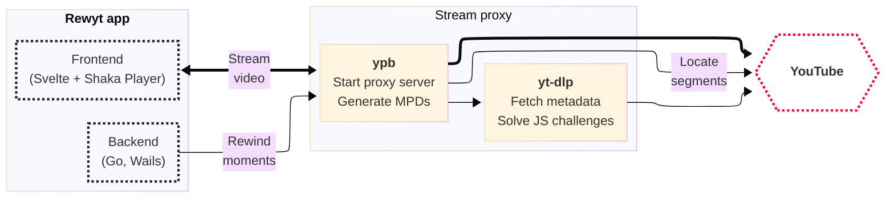

# Rewyt

_Rewind and play YouTube live streams_

This is a desktop app to rewatch past moments of live streams beyond YouTube's limits.

Built with [Go](https://go.dev/), [Svelte](https://github.com/sveltejs/svelte/),
[Shaka Player](https://github.com/shaka-project/shaka-player/), and packaged
with [Wails](https://github.com/wailsapp/wails/).

Available on Linux, macOS, and Windows.

## Overview

The app is built on a Go backend with a Svelte frontend. It uses our
**[ypb](https://github.com/xymaxim/ypb)** to locate moments in a live stream and
generate dynamic MPEG-DASH manifests. A proxy layer delivers media segments and
gracefully handles connection errors. **[Shaka
Player](https://github.com/shaka-project/shaka-player)** plays the video with
adaptive streaming from YouTube through the stream proxy.

## Installation

Rewyt comes as a (1) **desktop app** via pre-built binaries or (2) **web
app** via container, accessible through your browser. See the [Installation
guide](https://xymaxim.github.io/rewyt/guides/install/install.html) for setup
instructions.

## Credits

The font used in the application is [Geist](https://vercel.com/font). The
icons are from [Lucide Icons](https://lucide.dev/).

## Disclaimer

This app unfortunately violates YouTube's [Terms of
Service](https://www.youtube.com/t/terms), so use it at your own risk. You
might run into rate limits or get blocked if YouTube notices.

If you enjoy the videos you watch, please consider supporting the creators by
subscribing to their channels and engaging with their content directly.

## License

GNU Affero General Public License v3.0.
