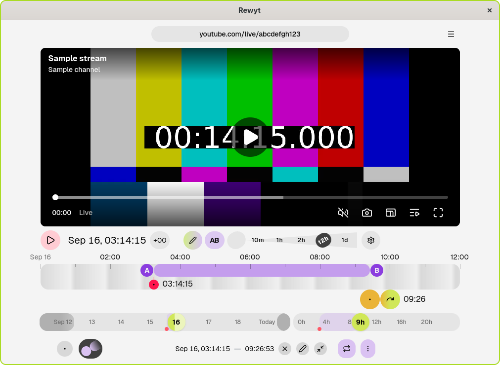

# Rewyt

[Source](https://github.com/xymaxim/rewyt) &nbsp; [Website](https://xymaxim.github.io/rewyt) &nbsp; [Documentation](https://xymaxim.github.io/rewyt/docs) &nbsp; [Changelog](https://xymaxim.github.io/rewyt/docs/changelog/)

*Rewind and play YouTube live streams*

Rewyt is a desktop app for rewatching past moments of live streams beyond
YouTube's limits.

Built with [Go](https://go.dev/), [Svelte](https://github.com/sveltejs/svelte/),
[dash.js](http://dashif.org/dash.js/), and packaged with
[Wails](https://github.com/wailsapp/wails/). Available on Linux, macOS, and
Windows.

## Overview

Rewyt runs on top of [ypb](https://github.com/xymaxim/ypb), a playback proxy
built around MPEG-DASH. It wraps
[yt-dlp](https://github.com/xymaxim/rewyt/blob/main/github.com/yt-dlp/yt-dlp),
which fetches media segment base URLs for each available format. When you rewind
to a moment, the frontend asks for an MPEG-DASH manifest started from that
moment, then dash.js player streams the video from YouTube through proxied
URLs. See [Overview](https://xymaxim.github.io/rewyt/docs/overview/) for more
details.

## Installation

Rewyt runs either as a [desktop
app](https://xymaxim.github.io/rewyt/docs/guides/install/desktop/) via
pre-built binaries or via
[Compose](https://xymaxim.github.io/rewyt/docs/guides/install/compose/),
which you run locally and access through your browser. See the
[Install](https://xymaxim.github.io/rewyt/docs/guides/install/install/)
guide for setup instructions.

## Etymology

1. *(n.)* from [Old
   English](https://archive.org/details/analectaanglosax00tho/page/240/mode/2up?q=rewyt)
   "rewyt", meaning *navigation*, *voyage*
2. *(v.)* to rewind and rewatch YouTube live streams, navigating through
   past moments

## Disclaimer

This app unfortunately violates YouTube's [Terms of
Service](https://www.youtube.com/t/terms). Use it at your own risk. If YouTube
notices, you might get rate-limited or temporarily blocked.

Please use it responsibly. Support the people you watch by subscribing to their
channels and liking or commenting on their content, and credit the original
video and channel if you share a clip or screenshot.

Read the full [usage
disclaimer](https://xymaxim.github.io/rewyt/docs/disclaimer/).

## Sponsoring

You can support this project by [sponsoring](SPONSORING.md) it.

## Credits

The font used in the application is [Geist](https://vercel.com/font). The icons,
including the one in the logo, are from [Lucide Icons](https://lucide.dev/).

## License

GNU Affero General Public License v3.0.
