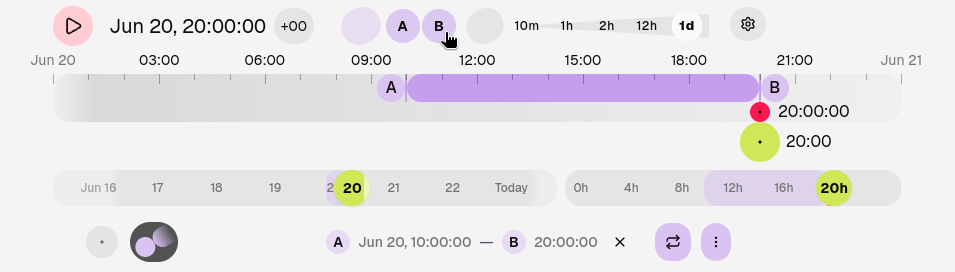
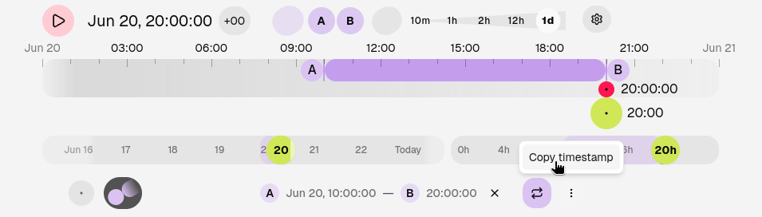

# Highlight and download excerpts

This guide shows you how to highlight a live stream excerpt and download it as a video file.

## Prerequisites

Rewyt doesn't download excerpts directly, you need [ypb](https://github.com/xymaxim/ypb) for that.

- Rewyt installed as a [desktop app](install/desktop.md) or [web
  app](install/web.md)
- [ypb](https://xymaxim.github.io/ypb/guides/install/install/) installed

!!! note

    If you're running Rewyt as a web app, `ypb` is already bundled inside its
    container, no separate install needed. Steps 1 and 2 below still apply,
    but for the download step, see [Download excerpts with
    Compose](download-excerpts-compose.md) instead.

## Steps

1. **Highlight an excerpt**

   Use the **A** and **B** buttons (or `a` and `b` keyboard shortcuts) to mark the start and end of your excerpt on the timeline.

   <figure>
   
   <figcaption aria-hidden="true">Highlighting an excerpt on the timeline</figcaption>
   </figure>

2. **Copy the timestamp**

   Open the **Highlight** tab at the bottom of the interface. Click **More**,
   then select **Copy timestamp**. This copies a timestamp that tells ypb
   exactly which part of the stream to download, for example:

   `2026-06-20T10:00:00+03:00/2026-06-20T20:00:00+03:00`

   <figure>
   
   <figcaption aria-hidden="true">Copying the timestamp of the highlighted excerpt</figcaption>
   </figure>

3. **Download the excerpt**

   Run the download command with the copied timestamp and the YouTube video ID:

   ```bash
   ypb download 2026-06-20T10:00:00+03:00/2026-06-20T20:00:00+03:00 abcdefgh123
   ```
   
By the end, you will have a downloaded file in your working directory when done.
   
## See also

See [Create a time-lapse
video](https://xymaxim.github.io/ypb/tutorials/timelapse/) to turn your excerpt into a time-lapse.
