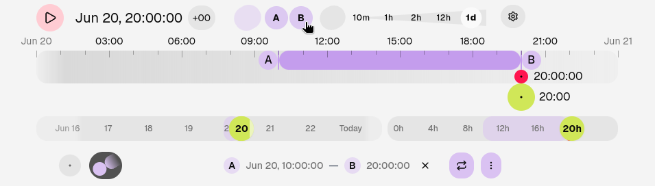

# Highlight and save clips

This guide shows you how to highlight a clip of a live stream and save it as a video file.

## Prerequisites

Rewyt doesn't save clips directly; you need [ypb](https://github.com/xymaxim/ypb) for that.

- Rewyt installed as a [desktop app](install/desktop.md) or via
  [Compose](install/compose.md)
- [ypb](https://xymaxim.github.io/ypb/guides/install/install/) installed

!!! note

    If you're running Rewyt via Compose, `ypb` is already bundled inside its
    container, no separate install needed. Steps 1 and 2 below still apply,
    but for the last step, see [Save clips with
    Compose](download-excerpts-compose.md) instead.

## Steps

1. **Highlight an interval**

   Use the **A** and **B** buttons (or `a` and `b` keyboard shortcuts) to mark the start and end of your clip on the timeline.

   <figure>
   
   <figcaption aria-hidden="true">Highlighting an interval on the timeline</figcaption>
   </figure>

2. **Copy the download command**

   Open the **Highlight** tab at the bottom of the interface. Click **More**,
   then select **Copy download**. This copies ypb's download command with an
   interval timestamp and YouTube video ID:

   `ypb download -i 2026-09-05T03:14:15+00:00/2026-09-05T09:26:53+00:00 abcdefgh123`

   <figure>
   
   <figcaption aria-hidden="true">Copying the download command for the highlighted interval</figcaption>
   </figure>

3. **Save the clip**

   Run the copied command:

   ```bash
   ypb download -i 2026-09-05T03:14:15+00:00/2026-09-05T09:26:53+00:00 abcdefgh123
   ```

When it finishes, you will have the clip as a video file in your working directory.

## See also

See [Create a time-lapse
video](https://xymaxim.github.io/ypb/tutorials/timelapse/) to turn your clip into a time-lapse.
