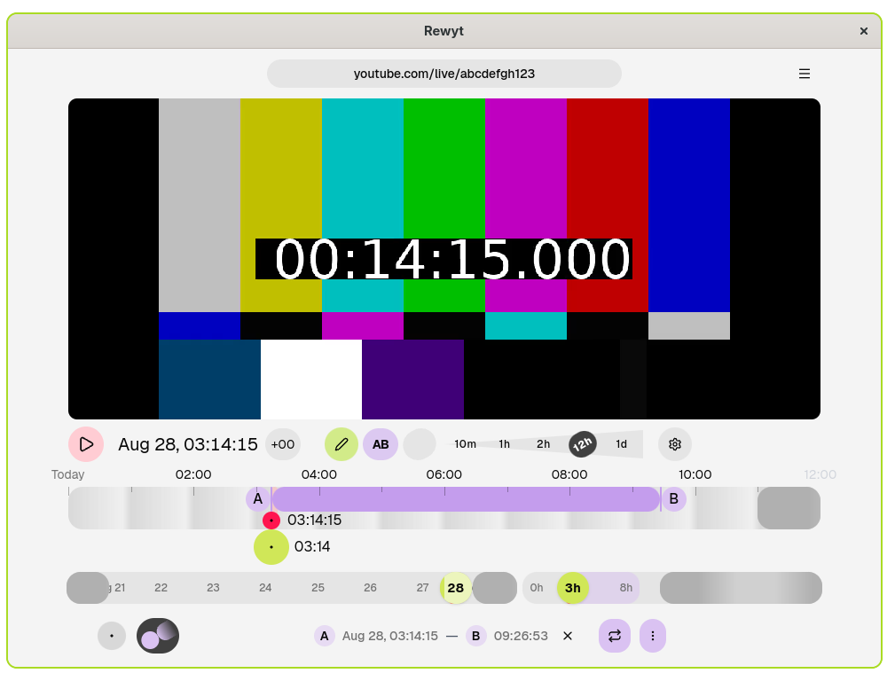

# Rewyt — Rewatch YouTube live streams

Rewyt is a desktop app for rewatching past moments of YouTube live streams, beyond
YouTube's limits. You can navigate and play streams interactively in the app or in your browser.

Available on Linux, macOS, and Windows. Built on top of
[ypb](https://xymaxim.github.io/ypb) and
[yt-dlp](https://github.com/yt-dlp/yt-dlp/).

## Start here

- **Getting started**

    ---

    A tour of the main usage in five minutes.

    :lucide-arrow-right: [Quickstart](quickstart.md)

- **Installation guide**

    ---

    How to install and run Rewyt.

    :lucide-arrow-right: [Install](guides/install/install.md)

