# Overview

Rewyt is built with Go, Svelte, [Shaka
Player](https://github.com/shaka-project/shaka-player), and packaged with
[Wails](https://wails.io).

<figure>

<figcaption aria-hidden="true"><i>Schematic overview of the Rewyt app</i></figcaption>
</figure>

<h2>Backend</h2>

The backend is built in Go and relies on two main
components. [ypb](https://github.com/xymaxim/ypb) locates specific moments in a
stream and creates the corresponding MPEG-DASH manifests that the player
needs. A proxy layer sits between the player and YouTube's servers, delivering
video segments and handling connection errors
gracefully. [yt-dlp](https://github.com/yt-dlp/yt-dlp) handles the supporting
work: fetching video metadata and solving the JavaScript challenges YouTube
requires for access.

<h2>Frontend</h2>

The frontend uses [Shaka
Player](https://github.com/shaka-project/shaka-player) to play the MPEG-DASH
manifests and stream video from YouTube through the stream proxy.

<!-- ```mermaid -->
<!-- --- -->
<!-- config: -->
<!--   flowchart: -->
<!--     defaultRenderer: elk -->
<!--     fontSize: 28px -->
<!--   theme: base -->
<!--   layout: dagre -->
<!--   look: neo -->
<!--   themeVariables: -->
<!--     dropShadow: false -->
<!-- --- -->
<!-- flowchart LR -->
<!--  subgraph Rewyt["`**Rewyt app**`"] -->
<!--     direction TB -->
<!--         A["Frontend<br>(Svelte + Shaka Player)"] -->
<!--         B["Backend<br>(Go, Wails)"] -->
<!--   end -->
<!--  subgraph CoreTools["Stream proxy"] -->
<!--     direction TB -->
<!--         C["`**ypb**<br>Start proxy server<br>Generate MPDs`"] -->
<!--         D["`**yt-dlp**<br>Fetch metadata<br>Solve JS challenges`"] -->
<!--   end -->
<!--     B -- Rewind<br>moments -\-> C -->
<!--     C -\-> D -->
<!--     D -\-> YT{{"`**YouTube**`"}} -->
<!--     C -- Locate<br>segments -\-> YT -->
<!--     A <== Stream<br>video ==> C -->
<!--     C ==> YT -->

<!--      A:::app -->
<!--      B:::app -->
<!--      YT:::yt -->
<!--     classDef app stroke:#222,stroke-dasharray: 3 3,stroke-width:3px,fill:none -->
<!--     classDef yt stroke:#ff0033,stroke-dasharray: 3 3,stroke-width:3px,fill:none -->
<!-- ``` -->
