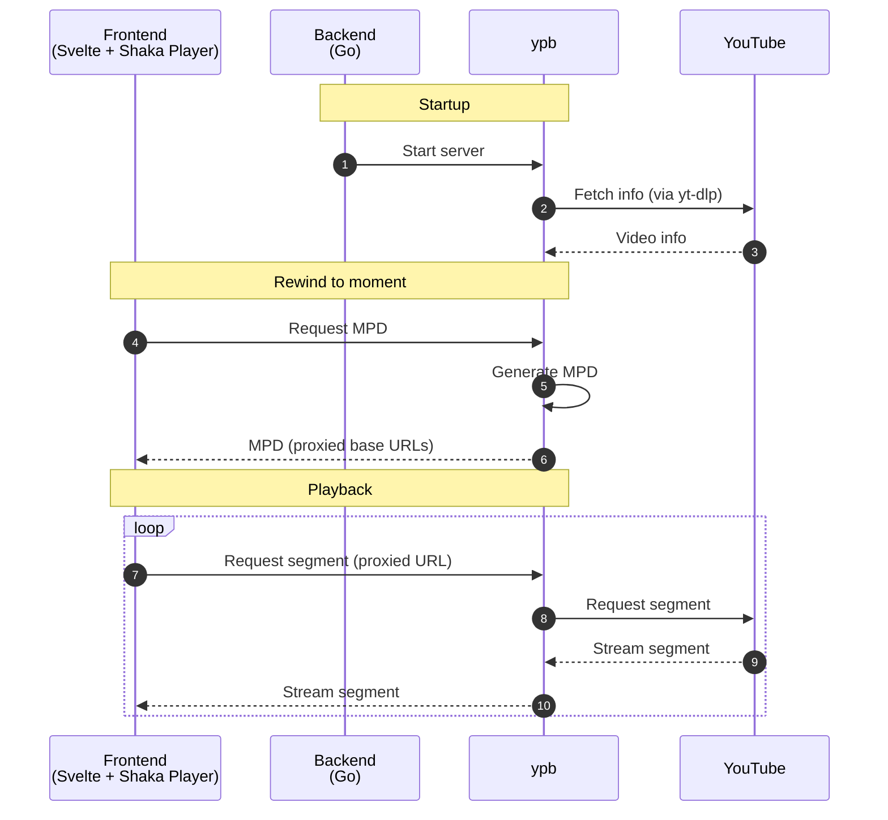

# Overview

Rewyt is built with Go, Svelte, [dash.js](https://dashif.org/dash.js/), and
packaged with [Wails](https://wails.io). It runs on top of
[ypb](https://github.com/xymaxim/ypb), a playback proxy built around MPEG-DASH
to provide access to past moments in YouTube live streams.

```mermaid
sequenceDiagram
    autonumber
    participant A as Frontend<br/>(Svelte + Shaka Player)
    participant B as Backend<br/>(Go)
    participant C as ypb
    participant Y as YouTube

    note over B,C: Startup
    B->>C: Start server
    C->>Y: Fetch info (via yt-dlp)
    Y-->>C: Video info

    note over A,C: Rewind to moment
    A->>C: Request MPD
    C->>C: Generate MPD
    C-->>A: MPD (proxied base URLs)

    note over A,C: Playback
    loop
        A->>C: Request segment (proxied URL)
        C->>Y: Request segment
        Y-->>C: Stream segment
        C-->>A: Stream segment
    end
```

On startup, the Go backend starts ypb, which fetches video information via
yt-dlp, including media segment base URLs for each available format. When you
rewind to a moment, the frontend asks for an MPEG-DASH manifest started from
that moment. During playback, the dash.js player streams video from YouTube
through ypb, using its proxied URLs.
