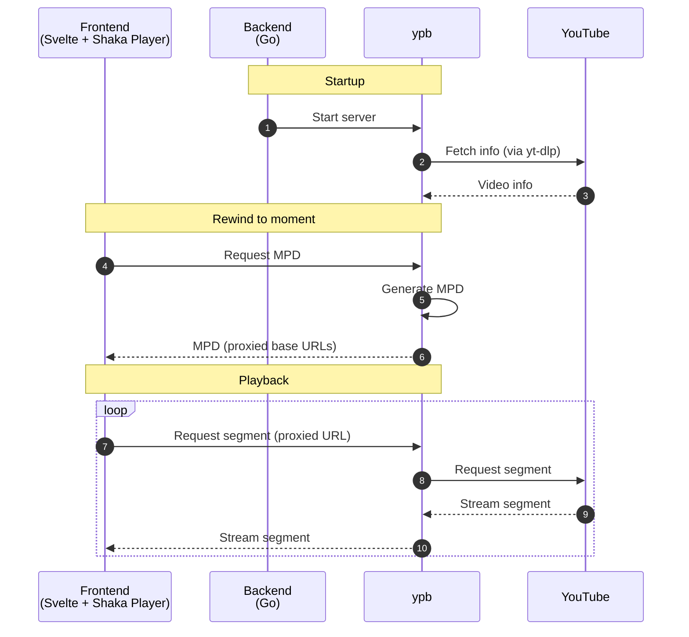

# Overview

Rewyt is built with Go, Svelte, [Shaka
Player](https://github.com/shaka-project/shaka-player), and packaged with
[Wails](https://wails.io).

```mermaid
sequenceDiagram
    autonumber
    participant A as Frontend<br/>(Svelte + Shaka Player)
    participant B as Backend<br/>(Go)
    participant C as ypb
    participant Y as YouTube

    note over B,C: Startup
    B->>C: Start server
    C->>Y: Fetch info (via yt-dlp)
    Y-->>C: Video info

    note over A,C: Rewind to moment
    A->>C: Request MPD
    C->>C: Generate MPD
    C-->>A: MPD (proxied base URLs)

    note over A,C: Playback
    loop
        A->>C: Request segment (proxied URL)
        C->>Y: Request segment
        Y-->>C: Stream segment
        C-->>A: Stream segment
    end
```

On startup, the Go backend starts [ypb](https://github.com/xymaxim/ypb), which
fetches video info via [yt-dlp](https://github.com/yt-dlp/yt-dlp). When you rewind to a
moment, the Svelte frontend requests an MPEG-DASH manifest from ypb, which
generates one with proxied URLs. During playback, [Shaka
Player](https://github.com/shaka-project/shaka-player) streams video through
ypb, which proxies media segments from YouTube and handles connection errors.
