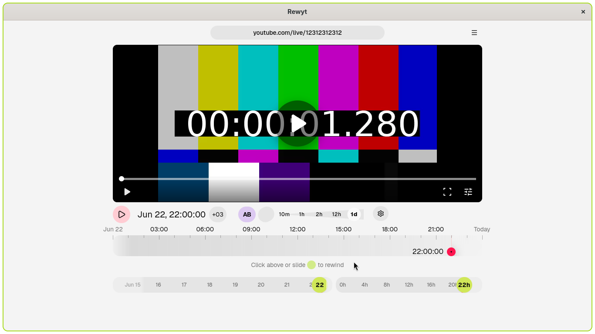
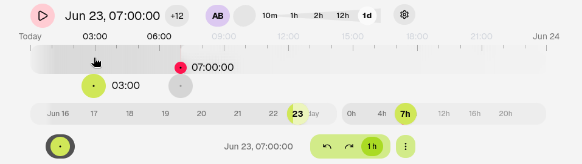
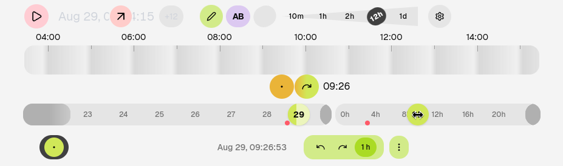

# Get started with Rewyt

Learn how to install Rewyt and start rewatching YouTube live streams.

## Installation

Rewyt comes as a **desktop app** (pre-built binary) or a **web app**
(container).

- **Desktop app**: choose this if you already have `yt-dlp` installed
- **Web app**: choose this if you don't, or prefer a self-contained setup

### Desktop app

Download the binary for your platform from the [latest
release](https://github.com/xymaxim/rewyt/releases/latest) and unzip it to your
working directory.

> For prerequisites and platform details, see [Desktop
> app](guides/install/desktop.md).

### Web app

Running Rewyt in containers gives you an isolated environment with `yt-dlp`,
`ffmpeg`, and `ypb` pre-installed, along with the PO token provider.

**Prerequisites:** [Podman](https://podman.io/getting-started/installation) or
[Docker](https://docs.docker.com/get-docker/), with Compose.

**macOS/Windows only, Podman:** Initialize the Podman machine (one-time setup):

    podman machine init && podman machine start

Pull the compose file and extract it to a local directory:

    podman artifact pull ghcr.io/xymaxim/rewyt-compose
    podman artifact extract ghcr.io/xymaxim/rewyt-compose ~/rewyt-app
    cd ~/rewyt-app

Start the app:

    podman compose up -d

Open the app in your browser:

    http://localhost:8080

> See [Web app](guides/install/web.md) for configuration options and more
> details.

## Verify installation

Open the app to see a welcome screen, where you can verify that your
installation is complete. If something's missing, you'll see a warning
describing what's needed. Otherwise, you're ready to go.

## Initial setup

Rewyt relies on yt-dlp's network-related options and cookies. Where you set them
depends on how you installed Rewyt:

- **Desktop app**: uses your local [yt-dlp configuration
  file](https://github.com/yt-dlp/yt-dlp#configuration) directly
- **Web app**: uses a yt-dlp configuration file mounted into the container, set
  by editing the `.env` file, see
  [Configuration](guides/install/web.md#configuration) for details

If YouTube responds with a "Sign in to confirm you're not a bot" error while
loading a stream, you'll need to provide cookies from a signed-in browser
session. See yt-dlp's wiki on how to
[export](https://github.com/yt-dlp/yt-dlp/wiki/Extractors#exporting-youtube-cookies)
and
[pass](https://github.com/yt-dlp/yt-dlp/wiki/FAQ#how-do-i-pass-cookies-to-yt-dlp)
cookies to yt-dlp.

## Rewatch a specific moment

### Open a live stream

To get started, you'll need a live stream to rewind. If you're not sure what to
watch, the [Cornell Lab Bird Cams](https://www.allaboutbirds.org/cams/) project
has beautiful bird cam streams from around the world. Let's use the [Northern
Royal Albatross nesting
cam](https://www.allaboutbirds.org/cams/royal-albatross/) at Taiaroa Head, New
Zealand.

Copy the [YouTube link](https://www.youtube.com/watch?v=Mm_zVDDUeNA) of the live stream and paste it into the input field in
the app. Wait for the stream to load. You'll see the main interface, with the
main controls, timeline, and sliders.

<figure>

<figcaption aria-hidden="true">Main interface showing the main controls with
timeline zoom levels, timeline, rewind slider with the rewind button, days
slider, and day slider</figcaption>
</figure>

### Set a timezone

By default, the app displays time in your local system timezone. Since you're
watching a stream from New Zealand, it's more convenient to match the stream's
local time instead.

Click the timezone label in the time display, below the video, to open the
timezone selector. Select New Zealand Standard Time (UTC+12) or New Zealand
Daylight Time (UTC+13).

### Click the timeline

Click anywhere on the timeline. The stream immediately rewinds to that moment
and starts playing.

<figure>

<figcaption aria-hidden="true">Selecting a time by clicking on the timeline</figcaption>
</figure>

Try zooming in on the timeline for a narrower time range, then click again to
land closer to the moment you want.

### Control with sliders

For more precision, use the rewind slider, days slider, and day slider
instead. Drag the days slider to pick a day, then drag the day slider to set a
specific time within that day. Sliders set your target time without
rewinding yet.

<figure>

<figcaption aria-hidden="true">Selecting a time using sliders without rewinding</figcaption>
</figure>

When you're happy with your selection, click the rewind button to jump there.

You can combine both methods: use the sliders to get close to a moment before
rewinding, then click the timeline to rewind to the exact moment.

## Next steps

Learn how to:

- [Highlight and download excerpts](guides/download-excerpts.md): save a specific part of a stream
- [Share and paste timestamps](guides/share-timestamps.md): share the moment you discovered and jump to a shared timestamp
